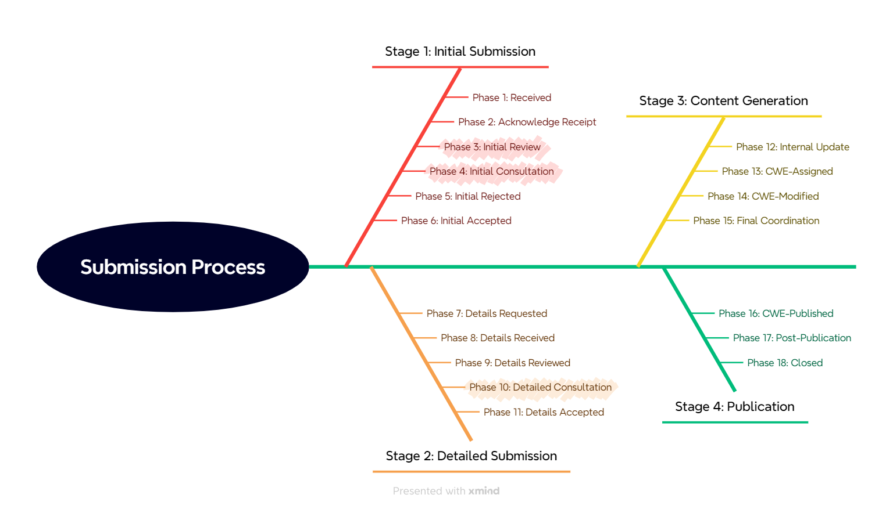

# Table of Contents
- [External Submissions Review Phases](#external-submissions-review-phases)
  - [Stage 1: Initial Submission](#stage-1-initial-submission)
    - [Phase 1: Received](#phase-1-received)
    - [Phase 2: Ack-Receipt](#phase-2-ack-receipt)
    - [Phase 3: Init-Review](#phase-3-init-review)
    - [Phase 4: Init-Consultation](#phase-4-init-consultation)
    - [Phase 5: Init-Rejected](#phase-5-init-rejected)
    - [Phase 6: Init-Accepted](#phase-6-init-accepted)
  - [Stage 2: Full Submission](#stage-2-full-submission)
    - [Phase 7: Full-Sub-Requested](#phase-7-full-sub-requested)
    - [Phase 8: Full-Sub-Received](#phase-8-full-sub-received)
    - [Phase 9: Full-Review](#phase-9-full-review)
    - [Phase 10: Full-Consultation](#phase-10-full-consultation)
    - [Phase 11: Full-Accepted](#phase-11-full-accepted)
  - [Stage 3: Content Generation](#stage-3-content-generation)
    - [Phase 12: Production](#phase-12-production)
    - [Phase 13: CWE-Assigned](#phase-13-cwe-assigned)
    - [Phase 14: CWE-Modified](#phase-14-cwe-modified)
    - [Phase 15: Final-Coordination](#phase-15-final-coordination)
  - [Stage 4: Publication](#stage-4-publication)
    - [Phase 16: CWE-Published](#phase-16-cwe-published)
    - [Phase 17: Post-Publication](#phase-17-post-publication)
    - [Phase 18: Closed](#phase-18-closed)

# External Submissions Review Phases

Each submission needs to be reviewed by the CWE team to determine if it is suitable for being included as new CWE
content. The External Submission review process can be thought of in 4 different stages: **Initial Submission**, **Full
Submission**, **Content Generation**, and **Publication**.  These stages, as well as the more granular phases within
each stage are described in detail below.

## Stage 1: Initial Submission 
An external submitter either provides a name, short description of the weakness, one or more references, and suggested
relationships for a new CWE submission or provides modification information to modify and existing CWE. The CWE Team
works with the submitter to ensure that the initial submission does not have any [submission
problems](submission-problems.md) that would prevent it from being integrated into CWE content.

### Phase 1: Received

The CWE Team receives an initial submission from the web submission server and creates an internal submission tracking
file.  Submissions in this phase will typically not be pushed to the CDR to ensure that the information provided is
suitable for public release.

### Phase 2: Ack-Receipt

The CWE Team notifies the original submitter that the initial submission has been received.  At this stage the
submission will be moved to the CDR, where a GitHub issue tracker will be created for the submission and the internal
submission tracking file will be pushed.

### Phase 3: Init-Review

A member of the CWE Team performs an initial review of the submission, going through each potential [submission
problem](submission-problems.md) and [scope exclusion](scope-exclusions.md) to ensure there are no issues.  Any
identified submission problem will be added to the submission tracking file and also indicated as a label to the CDR
issue tracker.

### Phase 4: Init-Consultation

Members of the CWE Team work with the submitter to resolve any identified submission problems. This discussion will
happen as comments under the submission's CDR issue tracker.

### Phase 5: Init-Rejected

The CWE Team rejects the initial submission and notifies the submitter.

### Phase 6: Init-Accepted

The CWE Team accepts the initial submission and notifies the submitter.

## Stage 2: Full Submission
If the initial submission is accepted, then the CWE Team asks the submitter to provide full details for the submission,
including over 10 different fields that will make the basis of a new CWE entry, such as potential mitigations, common
consequences, demonstrative code examples, and others. The CWE Team works with the submitter to ensure that the full
submission has appropriate, correct details.  

### Phase 7: Full-Sub-Requested

The CWE Team asks the submitter to provide full details for their submission.  Currently, this is done by posting a
comment to the CDR issue tracker.  The submitter can then move that comment to a text editor of their choice, add the
details inline, and reply with the updated information as a new comment to the CDR issue tracker.

### Phase 8: Full-Sub-Received

The submitter has provided the full submission details, but they have not yet been reviewed by the CWE team.

### Phase 9: Full-Review

The CWE Team reviews the full submission details, ensures that all requested details are provided, and performs a
quality check on each field within the submission.

### Phase 10: Full-Consultation

If necessary, the CWE Team works directly with the submitter to resolve any gaps or identified quality concerns.

### Phase 11: Full-Accepted

The CWE Team accepts the full, detailed submission.

## Stage 3: Content Generation
At this stage, all relevant details should have been provided. The CWE Team prepares the content for inclusion in the
next CWE version, whether as a new CWE entry, a modification to an existing entry/entries, or both. The CWE Team works
with the submitter and/or the community to address any small errors or omissions that might not have been addressed
during earlier stages.

### Phase 12: Production

The CWE Team begins to integrate appropriate details into its internal repository of CWE content, which is used to
generate new CWE versions.

### Phase 13: CWE-Assigned

For any new entry/entries, the CWE Team assigns a CWE identifier and translates the full submission's content into XML
format.

### Phase 14: CWE-Modified

For any entry/entries requiring modification, the CWE Team integrates any modifications into XML format.

### Phase 15: Final-Coordination

The CWE Team performs final coordination with the submitter before the content is published, such as confirming credits
to the submitter, final review of the changes, etc.

## Stage 4: Publication
The changes are included in a new CWE version, whether as a new CWE entry, a modification to an existing entry/entries,
or both.

### Phase 16: CWE-Published

The CWE changes and/or new entries are published in a new CWE version.

### Phase 17: Post-Publication

The CWE Team notifies the submitter of the publication and determines if any additional changes are necessary.

### Phase 18: Closed

The CWE Team closes the external submission, and no more action is necessary. Any future changes, if needed, would apply
to the relevant CWE entry/entries.